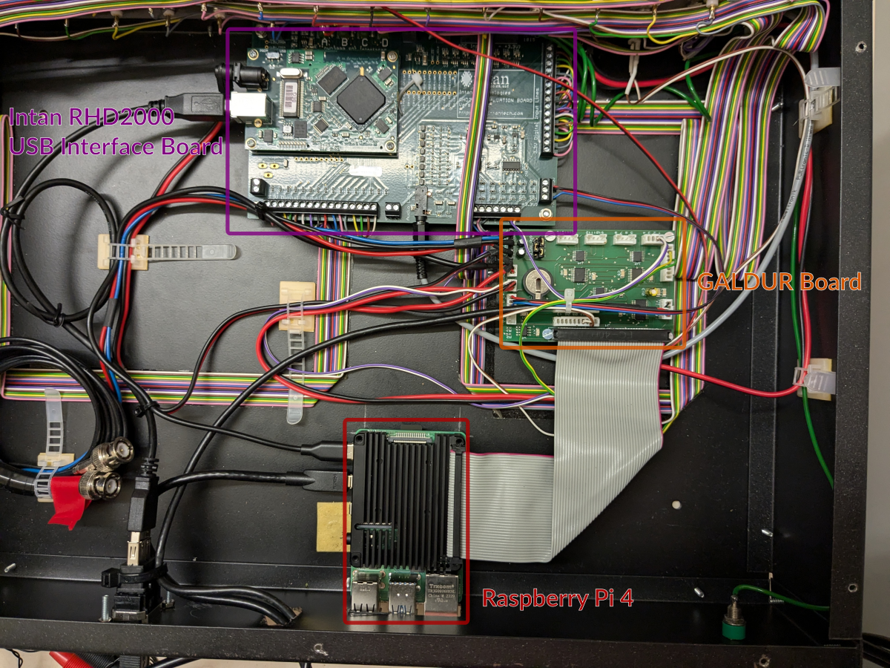

# GALDUR Board For Raspberry Pi 3/4+

This repository contains the hardware description files for the GALDUR board,
a Raspberry Pi 3+ hat that contains:

* Two 16-bit ADCs
* One 16-bit DAC
* UART connectivity for serial communication with the host
* A realtime clock to keep the current date/time

In combination with the [LaBrStim](https://github.com/bothlab/labrstim) software running on the Raspberry Pi,
and an Intan Technologies RHD2000 USB Interface Board, it can be used for extremely fast detection of
Sharp-Wave-Ripple events in brain signals by using the Intan board's ADC outputs.

The detected events can then be disrupted with low latency.

Check out the LaBrStim software or the GALDUR module in [Syntalos](https://syntalos.org) to learn which
pattern detections are currently implemented.

### Assembly overview of a whole system using the GALDUR board

